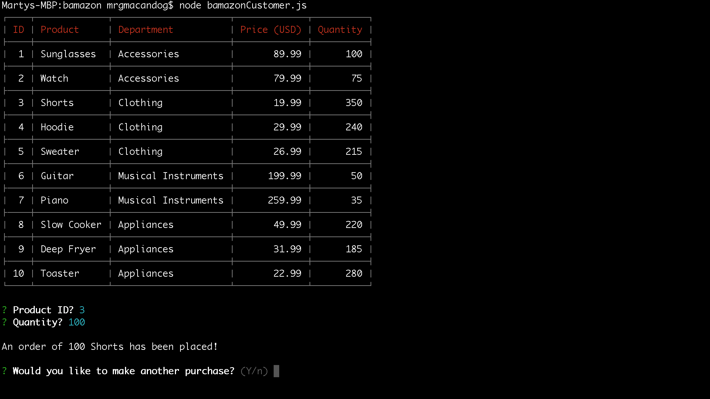
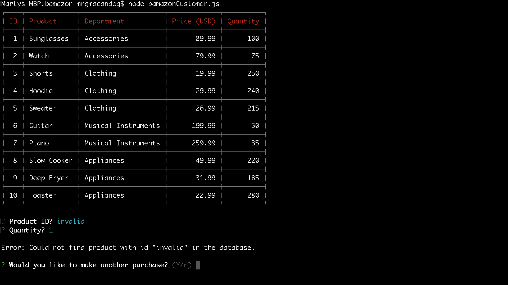
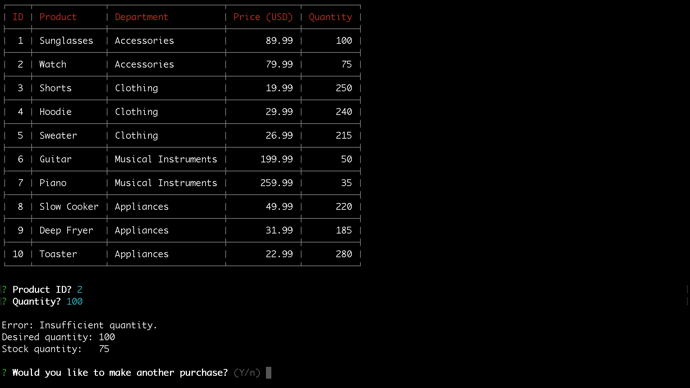
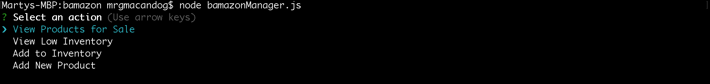
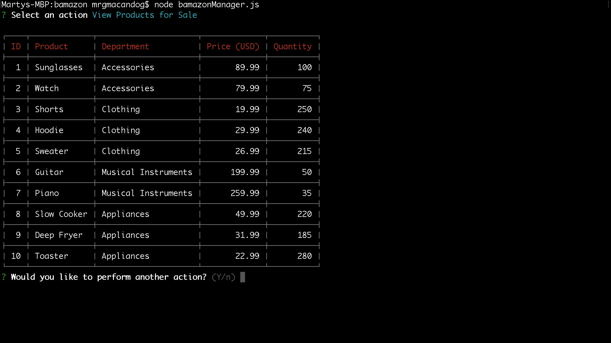
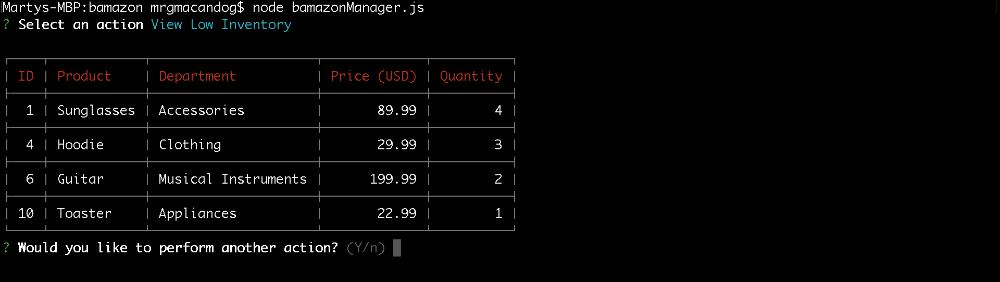
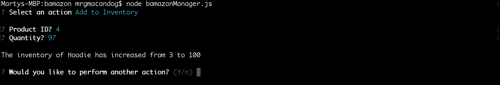
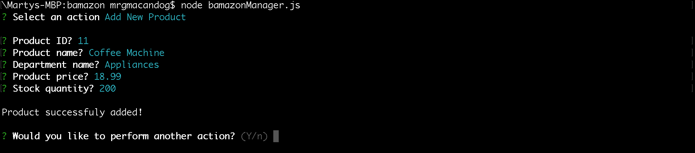

# Bamazon
This CLI app allows "customers" to purchase items from Bamazon and "managers" to update the products from Bamazon.


---


## Setup
Follow these 3 steps before using the app:
1. Install all package dependencies using the node command `npm` `install`.

2. Create a `.env` file that includes your MySQL Root Password without any quotes. It should look like the following:

    ```
    # MySQL Root Password

    ROOT_PASSWORD=your-password
    ```
3. Set up the database with `schema.sql` and use `seeds.sql` to populate it.


---


## Using the app as a Customer

To use the app as a customer, run `node` `bamazonCustomer`. A table with all the products will be displayed and then you will be prompted for the product id and quantity you want to purchase. After every order, you will be prompted if you want to place another order.

### Successful Order

If your order is processed successfully, a notification will show that the order is placed.



### Error: Invalid ID

If you provide an invalid id, the order will not go through.



### Error: Insufficient Stock Quantity

If you provide a quantity that is lower than the stock quantity, the order will not go through and your desired quantity and the stock quantity will be displayed.




---


## Using the app as a Manager

To use the app as a manager, run `node` `bamazonManager`. A prompt with all the possible actions will be displayed and you can use the arrow keys to navigate to your desired action. After every action, you will be prompted if you want to perform another action.



### View Products for Sale

This action displays all the products for sale



### View Low Inventory

This action displays all the products that have low inventory (less than 5 quantity).



### Add to Inventory

This action prompts you the product id and how much you want to increase its stock quantity. On completion, you will be notified the previous and new stock quantity.



### Add New Product

This action prompts you to type information regarding the product you want to add. For example: product ID, product name, department name, product price, and product stock quantity. You will be notified if the product has been successfully added.




---


## Implementation

### Node
- Running JavaScript on the backend
- Creating a CLI app
- Ability to use code snippets from other packages

### Package Dependencies

| Package | Purpose |
| ------- | ------- |
| [DotEnv](https://www.npmjs.com/package/dotenv) | Set private keys (MySQL root password) |
| [MySQL](https://www.npmjs.com/package/mysql) | Create connections to MySQL databases and perform CRUD operations on them |
| [Inquirer.js](https://www.npmjs.com/package/inquirer) | Get user input in the command line |
| [CLI Table](https://www.npmjs.com/package/cli-table) | Print out formatted tables in the command line |


